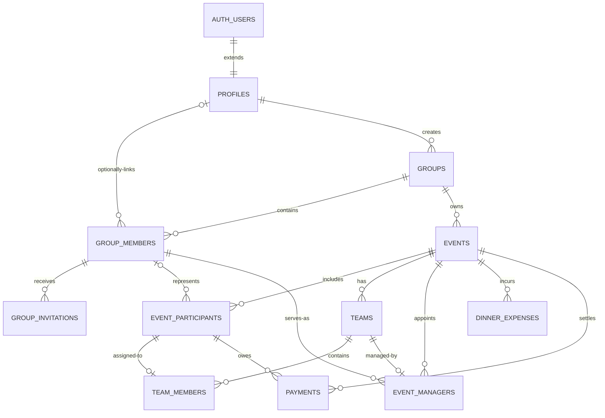

# Miércoles FC database foundation

PR05 establishes the Supabase/PostgreSQL contract for later identity and product features. The committed migrations are the schema source of truth; Dashboard-only schema changes are not part of the workflow.

## Architecture and identity

Supabase Auth owns authentication identity. `profiles.id` extends `auth.users.id` without duplicating email, password, or provider data. A profile is not the same as a group member:

- `profiles` represents one authenticated person.
- `group_members` represents a person's identity and persistent role inside one group.
- `group_members.profile_id` is nullable, so an admin can create “Lucas” before Lucas registers.
- A partial unique index prevents one profile from being linked twice to the same group while allowing multiple unlinked people to share a display name.
- Linking an existing member to a profile is intentionally deferred to the invitation flow in PR07.



All major entities use database-generated UUIDs and `timestamptz`. Mutable records use a shared trigger to maintain `updated_at`.

## Events, participants, and guests

`event_participants` is the event-scoped identity used by teams and payments. Each row represents exactly one of:

- a registered `group_member`; or
- a guest name that exists only for that event.

The XOR check prevents rows with both or neither identity. A unique constraint prevents the same group member from being added twice to one event. Guest names are deliberately not unique because names are not identifiers and two distinct guests may share one.

Group-member participants, event managers, and dinner-expense payers are protected by database triggers that require the member to belong to the event's group. Guests remain first-class participants with stable UUIDs and need no Auth or persistent membership row.

## Attendance

Confirmation and actual attendance are independent:

| Concern           | Columns             | Values                 |
| ----------------- | ------------------- | ---------------------- |
| Football response | `football_response` | `UNKNOWN`, `YES`, `NO` |
| Dinner response   | `dinner_response`   | `UNKNOWN`, `YES`, `NO` |
| Actual football   | `actual_football`   | `UNSET`, `YES`, `NO`   |
| Actual dinner     | `actual_dinner`     | `UNSET`, `YES`, `NO`   |

This avoids ambiguous nullable booleans. Future settlement must use actual attendance, never confirmation.

## Roles, teams, and managers

Persistent membership roles are the PostgreSQL enum `ADMIN | MEMBER`. “Manager/DT” is not a persistent role: `event_managers` assigns a group member to exactly one team for one event. One team has at most one manager in v1, and one member manages at most one team per event. Being a manager, player, or group admin are independent concepts.

`team_members` references `event_participants`, not profiles, so guests can play. Composite foreign keys require the team and participant to belong to the same event. The `(event_id, event_participant_id)` unique constraint prevents concurrent writes from placing one participant on multiple teams.

## Invitations and tokens

`group_invitations` targets a specific `(group_member_id, group_id)` pair. It stores only a 32-byte token hash, never a raw bearer token. A partial unique index allows only one active invitation per member. Acceptance, revocation, token generation, and profile linking are deferred to PR07.

## Money and payments

Money uses signed PostgreSQL `bigint` minor units, never floating point. For ARS, `5000000` represents ARS 50,000.00. Each event carries a three-letter `currency_code` (default `ARS`), and all of its court price, expenses, and payments use that currency.

Dinner total is derived from `sum(dinner_expenses.amount_minor)` and is not duplicated. The nullable dinner payer currently references only a group member; recording a guest as the direct purchaser is intentionally deferred until there is a concrete product requirement.

Payments reference event participants, supporting members and guests equally. `COURT` and `DINNER` are independent categories. A unique constraint permits only one row per event/participant/category. `PENDING` requires `paid_at = null`; `PAID` requires a timestamp. Partial payments are outside v1.

## Concurrency and integrity

PostgreSQL, rather than a prior client-side `SELECT`, protects:

- one linked membership per profile/group;
- one active invitation per member;
- one registered member participation per event;
- one team name and position per event;
- one team assignment per participant/event;
- one manager per team and one managed team per member/event;
- one payment per participant/event/category;
- participant/team/event and manager/member/group consistency;
- valid attendance, status, role, currency, amount, and paid timestamp states.

All parent deletes use `RESTRICT` for groups, events, participants, teams, financial records, invitations, and authorship. A profile link on `group_members` uses `SET NULL`, preserving the group identity if an otherwise unreferenced profile is removed. No generic soft-delete layer is introduced.

## Indexes

Unique constraints provide indexes for most invariants and common event lookups. Additional indexes cover:

- `group_members(group_id)`;
- author/profile foreign keys on groups, memberships, invitations, events, and expenses;
- `group_invitations(group_id)`;
- `events(group_id, starts_at desc)`;
- `event_participants(group_member_id)` and `event_managers(group_member_id)`;
- `team_members(team_id)` and `team_members(event_participant_id)`;
- `dinner_expenses(event_id)` and its optional payer;
- `payments(event_participant_id)`.

Composite indexes follow the exact column order of the foreign keys that connect invitations, managers, payments, and team assignments to their parent records. This keeps referential checks and parent updates efficient and satisfies the hosted Supabase database advisor.

No speculative indexes or Realtime publications are enabled.

## RLS and API grants

RLS is enabled on every application-owned table. `anon` has no table privileges. `authenticated` receives only the grants needed by the foundational policies:

- users can select and update their own profile; column grants restrict profile updates to `display_name` and `avatar_url`;
- linked members can read their groups, co-members, events, participants, teams, managers, expenses, and payments;
- only group admins can read invitation metadata;
- no browser role can insert or mutate business records yet.

Small `SECURITY DEFINER` helpers live in the unexposed `private` schema to avoid recursive RLS while checking membership. They set an empty `search_path`, qualify every object, verify `auth.uid()`, and expose only the minimum `EXECUTE` rights. Trigger helpers are not callable by browser roles.

The local configuration disables automatic Data API exposure. The migration uses explicit grants because grants and RLS are separate security layers. The `service_role` keeps administrative access but must never be shipped to the browser.

Feature-specific writes are deliberately deferred: profile creation to PR06, invitation mutations/linking to PR07, and group/business mutations to their owning PRs. Each future write policy must include both ownership checks and `WITH CHECK` where applicable.

## Browser configuration

Copy the example file and replace only the public values:

```bash
cp public/config/supabase-config.example.json public/config/supabase-config.json
```

Required values:

- `url`: project URL, such as `https://project-ref.supabase.co`;
- `publishableKey`: an `sb_publishable_...` browser key. A legacy anon key remains technically supported by the client but is not preferred.

The real file is Git-ignored and fetched with `cache: no-store`. Missing configuration does not block the placeholder App Shell, but injecting `SUPABASE_CLIENT` fails with a clear error. Secret/service-role keys are rejected defensively and must never be placed in public files.

For a clean development or production build, provide the same public values as environment variables and generate the runtime file before Angular builds:

```bash
SUPABASE_URL=https://project-ref.supabase.co \
SUPABASE_PUBLISHABLE_KEY=sb_publishable_replace_me \
npm run build:configured
```

Configure those variables in the deployment platform rather than in a committed `.env` file. The generated JSON is a browser asset, so it must contain only the publishable key; authorization still depends on RLS. `SUPABASE_CONFIG_OUTPUT` may point the generator at a temporary path for validation.

Local Auth uses `http://localhost:4200` as its Site URL and allows callback paths below both `localhost:4200` and `127.0.0.1:4200`. Before the first production authentication release, add the exact deployed callback URL to the hosted Supabase Auth redirect allow list and use the deployed origin as its Site URL. Avoid broad production wildcards.

## Local migration workflow

A Docker-compatible runtime is required by Supabase local development.

```bash
npm run supabase:start
npm run supabase:reset
npm run supabase:lint
npm run supabase:types
```

`supabase:reset` recreates the database from committed migrations. `supabase:types` replaces the bootstrap TypeScript contract with CLI-generated database types. Review and commit that generated diff whenever the schema changes.

Create later migrations through the CLI, never by inventing filenames:

```bash
npx supabase migration new descriptive_change_name
```

Before merging a schema change, reset from scratch, run database lint/advisors, test representative RLS access as unrelated users, regenerate types, and run the Angular quality suite.

## Current limits

PR05 provides schema and access foundations only. The foundation migration is deployed to the linked Supabase project and the committed database types are generated from that hosted schema. It does not create users, sessions, groups, seed business data, Realtime subscriptions, settlement calculations, or business UI. The current development host still needs a Docker-compatible runtime to execute the optional local `supabase db reset` workflow.
